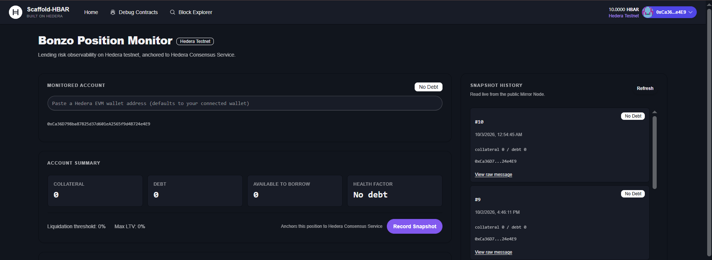
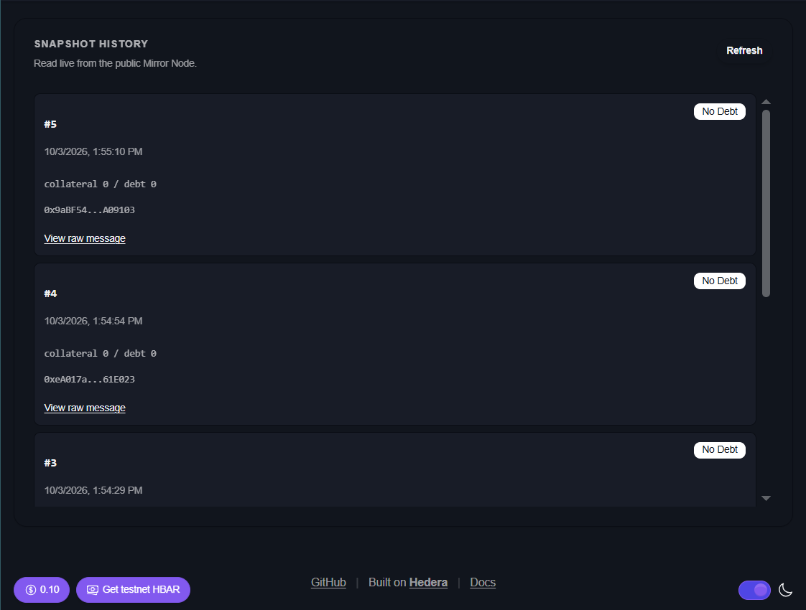

# lend-pulse: Bonzo Lending Risk Monitor (Scaffold-HBAR)

A Scaffold-HBAR template for building auditable lending-risk monitors on Hedera.

It reads a wallet's live lending position directly from [Bonzo Finance](https://bonzo.finance)'s deployed contracts on Hedera testnet, an Aave V2-based lending protocol, and lets a developer anchor a point-in-time risk snapshot of that position to Hedera Consensus Service (HCS). Each snapshot becomes part of a permanent, publicly verifiable history that the app reads back from Hedera's Mirror Node. No database required.

**What this demonstrates:**
- A direct integration with an external Hedera ecosystem protocol (Bonzo). Remove Bonzo and the template has nothing to monitor.
- HCS used as a versioned, structured observation log, with every snapshot carrying a consensus timestamp and a Mirror Node link for independent verification
- Server-side snapshot generation: the browser sends only a wallet address, and the server reads Bonzo itself before anything is written to HCS
- A reusable pattern for risk-monitoring and audit tools on Hedera

## Quick start

Scaffold your own copy:

```bash
npm create scaffold-hbar@latest -- --template omni6nt/lend-pulse
```

If the CLI asks for framework choices, pick Next.js (App Router) and Hardhat. This template contains only a Hardhat package.

Or clone this repository, then:

1. Run `yarn install`
2. Copy `packages/nextjs/.env.example` to `packages/nextjs/.env.local`, add your testnet credentials, and set `ENABLE_SNAPSHOT_WRITES=true` (see Setup below)
3. Create your own HCS topic: `node --env-file=packages/nextjs/.env.local packages/nextjs/scripts/createTopic.mjs`, then put the printed Topic ID into `.env.local`
4. Run `yarn next:dev`
5. Open `http://localhost:3000/monitor`
6. Paste any Hedera EVM wallet address, or use your connected wallet
7. Read the account summary and the Bonzo markets table
8. Click **Record Snapshot**
9. Follow the returned HashScan or Mirror Node link to verify the transaction
10. See every past snapshot, each with its own Mirror Node link, in the history panel

## Architecture

```
Wallet address
      |
      v
Bonzo LendingPool + DataProvider
(Hedera testnet, already deployed)
      |
      v
Position and market data  --->  Dashboard (reads via wagmi / viem)
      |
Record Snapshot (user action: sends the wallet address only)
      |
      v
Next.js API route
 - re-reads the position from Bonzo itself
 - computes the risk status
 - signs with operator keys (server-side only)
      |
      v
Hedera Consensus Service
(versioned schema, one topic)
      |
      v
Hedera Mirror Node (public)
      |
      v
Snapshot history panel
```

## A note on Bonzo's current state

Bonzo Finance suffered an oracle exploit in July 2026, and its lending pools were paused at the time of writing. Most wallets you check will show an empty position, with zero collateral and zero debt. This is expected. The read path works against Bonzo's real, deployed testnet contracts regardless of pool status, and reports whatever state the protocol is actually in.

## Risk status labels

The dashboard shows a risk status derived from the `healthFactor` that Bonzo returns:

| Health factor | Label |
| --- | --- |
| No debt (`maxUint256`) | No Debt |
| < 1 | At Risk |
| 1 to < 1.2 | Caution |
| >= 1.2 | Healthy |

**This classification is lend-pulse's own, not Bonzo's.** Bonzo returns the raw health factor. The labels and thresholds are an interpretation layer this template adds for readability, and are not an official protocol standard.

## What's in this template

- Next.js App Router with wallet connect (inherited from Scaffold-HBAR)
- `/monitor` dashboard: collateral, debt, available borrows, health factor, liquidation threshold, max LTV and risk status for any Hedera EVM address, read through Bonzo's `getUserAccountData`
- Bonzo markets table: per-reserve LTV, liquidation threshold, active or frozen status, and the monitored wallet's supplied and borrowed amounts, read through `getReserveConfigurationData` and `getUserReserveData`
- **Record Snapshot** button: sends the wallet address to `/api/snapshot`, which reads the position from Bonzo itself and anchors the result to HCS using the versioned schema `lend-pulse.snapshot.v1`
- `/api/snapshot`: the only place that touches Hedera operator credentials. Keys never reach the browser, and values sent by the client are ignored
- Write guard: `/api/snapshot` refuses to submit unless `ENABLE_SNAPSHOT_WRITES=true`
- Snapshot history panel: reads past snapshots from the public Mirror Node with consensus timestamps and a raw-message link per entry. Snapshots recorded before the risk field existed show "N/A"
- Automated tests (`yarn workspace @sh/nextjs test`): cover input validation, the write guard, missing configuration, the server-side Bonzo read, risk classification, successful submission and HCS failure handling, using a mocked Hedera SDK and a mocked contract read so they never touch the live network
- A Hardhat package is present from the Scaffold-HBAR base but unused. This template only reads from Bonzo's already-deployed contracts, so it deploys none of its own

## Work from this repository

This project uses Yarn workspaces.

### Prerequisites

- [Node.js](https://nodejs.org/) >= 20.18.3
- [Git](https://git-scm.com/) with `user.name` and `user.email` configured
- [Yarn](https://yarnpkg.com/), via Corepack:

```bash
corepack enable && corepack prepare yarn@stable --activate
```

### Setup

```bash
yarn install
cp packages/nextjs/.env.example packages/nextjs/.env.local
```

Fill in `packages/nextjs/.env.local`:

```
HEDERA_OPERATOR_ID=0.0.your_account_id
HEDERA_OPERATOR_KEY=your_private_key
HEDERA_TOPIC_ID=0.0.your_topic_id
NEXT_PUBLIC_HEDERA_TOPIC_ID=0.0.your_topic_id
ENABLE_SNAPSHOT_WRITES=true
```

- Get a free testnet account and HBAR from the [Hedera Portal faucet](https://portal.hedera.com/faucet).
- Create your own HCS topic (one-time):

```bash
node --env-file=packages/nextjs/.env.local packages/nextjs/scripts/createTopic.mjs
```

This prints a Topic ID. Put it in both `HEDERA_TOPIC_ID` (used by the server to write) and `NEXT_PUBLIC_HEDERA_TOPIC_ID` (used by the browser to read history).

- `ENABLE_SNAPSHOT_WRITES` is off by default so a deployed copy cannot spend operator HBAR by accident.
- If `NEXT_PUBLIC_HEDERA_TOPIC_ID` is not set, the history panel shows a public sample topic (`0.0.10759541`).
- Never prefix the operator variables with `NEXT_PUBLIC_`. That would expose the key to the browser.

### Run

```bash
yarn next:dev
```

Open [http://localhost:3000/monitor](http://localhost:3000/monitor).

### Test

```bash
yarn workspace @sh/nextjs test
```

## Screenshots

Dashboard with account summary, risk status and Bonzo markets:



Snapshot history, read live from the public Mirror Node:



## Verified example

A snapshot recorded with the final build, verifiable on HashScan: [transaction 1791030270.119219921](https://hashscan.io/testnet/transaction/1791030270.119219921) (message type `SUBMIT MESSAGE`).

**What this shows:** this application submitted a specific snapshot to a specific topic, and Hedera reached consensus on it at a specific timestamp.

**What this does not show:** that Bonzo's underlying numbers are correct. HCS anchors an observation that lend-pulse made. It does not independently verify the source data.

## Security

`/api/snapshot` holds your Hedera operator credentials server-side and signs a real transaction for each request. Writes are disabled unless `ENABLE_SNAPSHOT_WRITES=true`, and the route builds each snapshot from its own Bonzo read instead of trusting values from the browser. Before deploying publicly, add authentication or rate limiting to this route, because anyone who can reach it with writes enabled can spend HBAR from your operator account.

## Project layout

- **packages/nextjs**: Next.js app
  - `app/monitor/page.tsx`: the dashboard
  - `app/api/snapshot/route.ts`: server-side Bonzo read and HCS write
  - `app/api/snapshot/route.test.ts`: tests for the route
  - `contracts/externalContracts.ts`: Bonzo's deployed contracts and the ABI functions used
  - `scripts/createTopic.mjs`: one-time HCS topic creation
- **packages/hardhat**: present from the Scaffold-HBAR base, currently unused

## Links

- [Scaffold HBAR docs](https://docs.hedera.com/solutions/tools/scaffold-hbar/index)
- [Bonzo Finance docs](https://docs.bonzo.finance)
- [Hedera Portal faucet](https://portal.hedera.com/faucet)
- [HashScan](https://hashscan.io/)